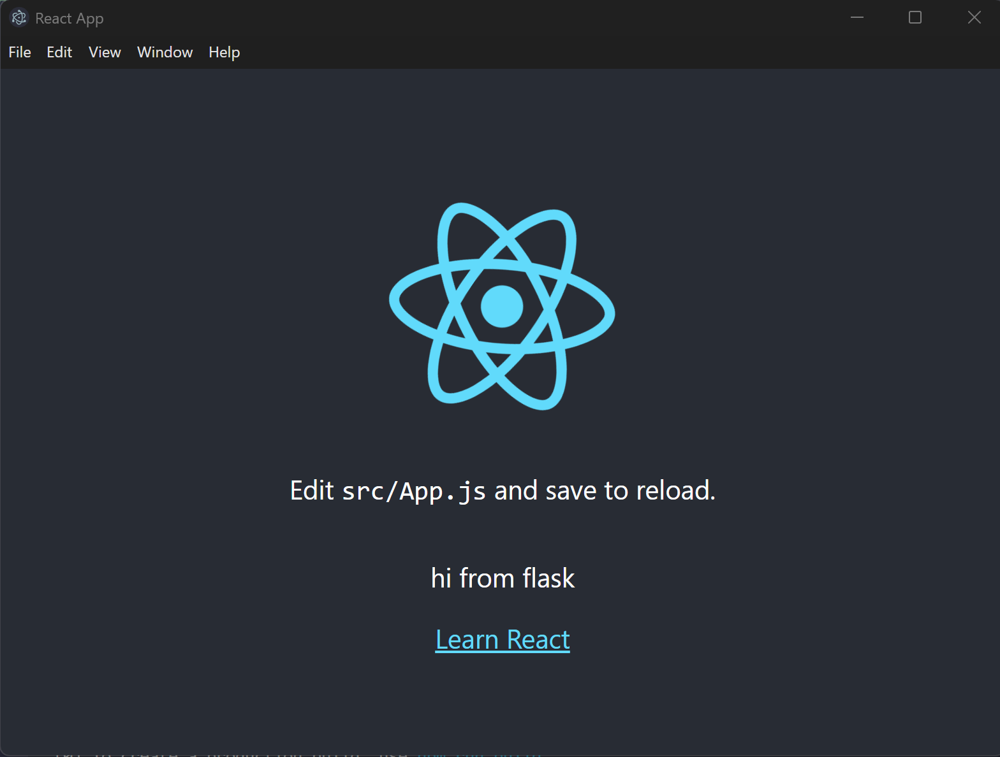
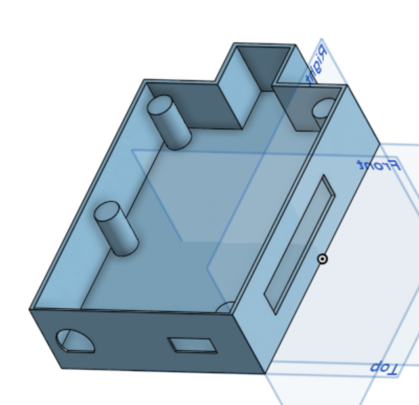

# mmWavedar

# Development Guide
1. Go into the gui/ folder and run `npm install` to install dependencies.
2. Initialize the Python virtual environment.

```
python -m venv venv
. venv/Scripts/activate
pip install -r server/Requirements.txt
```
3. Start the development server with `npm run dev`.

__Note: the proxy may require you to add the following to your .env__
```
DANGEROUSLY_DISABLE_HOST_CHECK=true
```

To format the code we can use Biome in the `gui/` folder
```
npx @biomejs/biome format ./src --write
```



# mmWave PCB
In Progress (Began adding and drawing schematic components)

# Wall Mounted Housing


Link to Bottom of Case: https://cad.onshape.com/documents/f38a52434846a7189f9644c0/w/7e0a08a9ef13306c54f119f5/e/8beed967b12d6dec285ed4a6?renderMode=0&uiState=68fecf343d09582aa8c72b42
